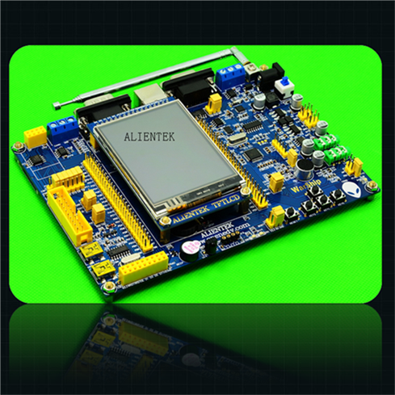

# STM32-Base
Microprocessor: STM32F103ZET6, Project board: ALIENTEK WARSHIP, Compiler tools: KEIL MDK-ARMv5

# Hardware and Software
Microprocessor: STM32F103ZET6
Project board: ALIENTEK WARSHIP 
Compiler tools: KEIL MDK-ARMv5
STM32F10X firmware library
Download tools: FlyMcu.exe
USART software: eaglecom.exe

# Task1: GPIO, LED, KEY and Buzzer, Using Fw_Lib to Registers

# Task2: Clock tree, USART (serial port /RS-232), Check status with registers

# Task3: FSMC Flexible Static Memory Controller, FSMC memory mapping, TFT LCD controlling, Draw Box function, Draw characters

# Task4: EXTI external interrupt, Interrupt priority, PS/2 keyboard

# Task5: General Purpose Timer, SYSTICK and system exception handler, Interrupt and subroutine overhead, PWM and Tri-color LED

